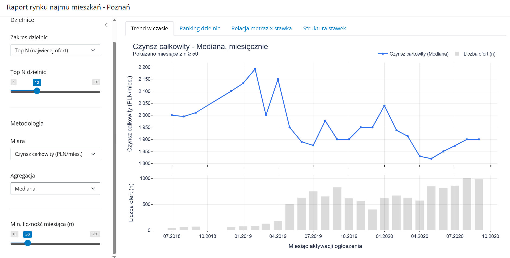
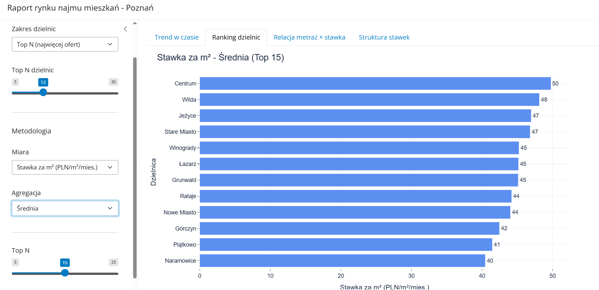
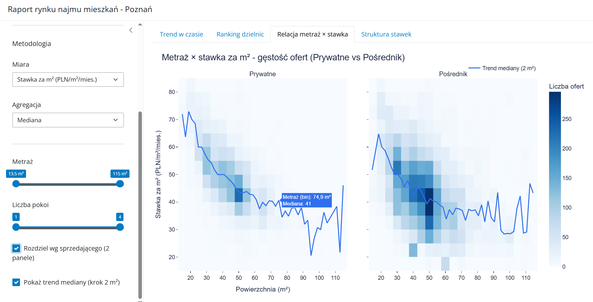
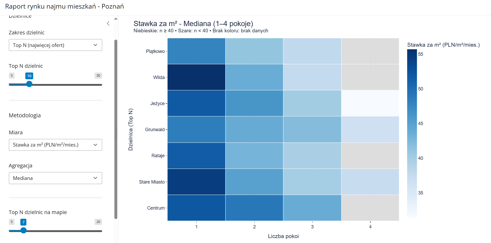

# Poznań Rent Dashboard

Interactive Shiny for Python dashboard for exploratory analysis of the residential rental market in Poznań.

The application visualizes apartment rental listings and allows users to analyse rent levels, price per square meter, district rankings, apartment size effects and room-count based rent structures using interactive Plotly charts.

## Live demo

[Open the dashboard](https://rent-dashboard-3.onrender.com/)

## Project overview

The goal of this project is to build an interactive data application for analysing rental apartment listings in Poznań.

The dashboard is designed to help users explore how rental prices differ across districts, apartment sizes, number of rooms and listing types. It combines data preprocessing, aggregation and interactive visualization in a web application built with Shiny for Python.

The project demonstrates:

- building an interactive dashboard in Python
- preparing and transforming real estate listing data
- creating dynamic filters and reactive visualizations
- deploying a Python web application on Render
- presenting market data in a clear analytical format

## Features

- Interactive sidebar filters
- District selection and Top N district filtering
- Monthly rental market trend analysis
- District ranking by selected rental metric
- Price per square meter analysis
- Total monthly rent analysis
- Private owner vs agency comparison
- Apartment area vs rent rate visualization
- Heatmap of rental rates by district and number of rooms
- Median / mean aggregation selection
- Minimum sample size filters for more stable statistics
- Interactive Plotly charts

## Dataset

The application uses the file:

```text
rent-poznan.xlsx
```

The dataset contains apartment rental listings for Poznań.

The dashboard uses variables such as:

- listing activation date
- district
- rent price
- additional rent / service charges
- total monthly cost
- apartment area
- number of rooms
- seller type

## Dashboard views

### 1. Market trend over time

Shows monthly changes in the selected rental metric together with the number of listings available in each month.

This view helps identify changes in rental rates over time and compare them with listing volume.

### 2. District ranking

Ranks Poznań districts by the selected metric, such as price per square meter or total monthly rent.

This view helps compare relative rental affordability and market levels across districts.

### 3. Apartment area vs price per square meter

Shows the relationship between apartment size and price per square meter.

The view also compares listings offered by private owners and agencies, making it easier to identify differences in pricing patterns.

### 4. Rate structure heatmap

Displays rental rate differences across districts and room-count segments.

The heatmap helps identify which district and apartment-size combinations are relatively more or less expensive.

## Screenshots

### Market trend over time



### District ranking



### Apartment area vs price per square meter



### Rate structure heatmap



## Methodology

The dashboard calculates and visualizes several rental market metrics:

- total monthly cost as base rent plus additional charges
- price per square meter
- monthly listing activation periods
- district-level rental statistics
- median or mean aggregation
- rankings based on selected indicators
- room-count based heatmaps
- sample-size filtering to reduce noise from small groups

The analysis is exploratory and intended to support quick visual inspection of the rental market.

## Technologies

- Python
- Shiny for Python
- pandas
- NumPy
- Plotly
- openpyxl
- shinywidgets
- Render

## Repository structure

```text
rent-dashboard/
├── assets/
│   ├── trend-over-time.png
│   ├── district-ranking.png
│   ├── area-vs-rate.png
│   └── rate-structure-heatmap.png
├── app.py
├── rent-poznan.xlsx
├── README.md
└── requirements.txt
```

## How to run locally

Clone the repository:

```bash
git clone https://github.com/Kiedro12/rent-dashboard.git
cd rent-dashboard
```

Install the required dependencies:

```bash
pip install -r requirements.txt
```

Run the Shiny application:

```bash
shiny run --reload --launch-browser app.py
```

The app expects the file `rent-poznan.xlsx` to be located in the same directory as `app.py`.

Alternatively, the data path can be provided through the `RENT_DATA_PATH` environment variable.

## Deployment

The application is deployed on Render as a Python web service.

Live app:

```text
https://rent-dashboard-3.onrender.com/
```

Render configuration:

```text
Build command:
pip install -r requirements.txt

Start command:
shiny run --host 0.0.0.0 --port $PORT app.py
```

The app uses the `PORT` environment variable provided by Render.

The server is bound to `0.0.0.0`, which is required for external access in a hosted environment.

## Requirements

The project uses the following Python packages:

```text
shiny
pandas
numpy
openpyxl
plotly
matplotlib
seaborn
shinywidgets
```

## Limitations

- The dashboard is based on a single dataset snapshot.
- Results depend on the completeness and quality of the input data.
- The analysis is exploratory and should not be interpreted as a formal real estate valuation.
- Outliers and missing values may affect aggregated statistics.
- The application does not include automated data refresh.
- District-level comparisons may be sensitive to sample size in less represented areas.

## Possible extensions

- Add map-based visualization of Poznań districts
- Add automated data update pipeline
- Add deployment status badge
- Add GIF preview of dashboard interaction
- Add data validation before loading the application
- Split the code into separate modules for data loading, preprocessing and plotting
- Add tests for data preparation functions
- Add more advanced outlier handling
- Add downloadable filtered datasets

## Author

Created by [Kiedro12](https://github.com/Kiedro12).
